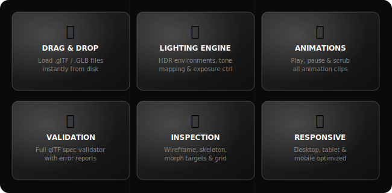
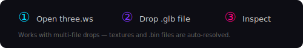

<video width="100%" height="auto" autoplay loop muted playsinline>
  <source src="https://github.com/nirholas/3D-Agent/raw/refs/heads/main/public/skills.mp4" type="video/mp4">
  Your browser does not support the video tag. 
</video>

<p align="center">
  <a href="https://three.ws/"><strong>🌐 Live at three.ws</strong></a>&nbsp;&nbsp;·&nbsp;&nbsp;
  <a href="#-quickstart"><strong>Get Started</strong></a>&nbsp;&nbsp;·&nbsp;&nbsp;
  <a href="#-features"><strong>Features</strong></a>&nbsp;&nbsp;·&nbsp;&nbsp;
  <a href="#-tutorials"><strong>Tutorials</strong></a>&nbsp;&nbsp;·&nbsp;&nbsp;
  <a href="#-documentation"><strong>Docs</strong></a>&nbsp;&nbsp;·&nbsp;&nbsp;
  <a href="https://github.com/nirholas/3d-agent/issues/new"><strong>Feedback</strong></a>
</p>

---

## 🧠 What is three.ws?

**three.ws** is an open-source, browser-native 3D model viewer built on [three.js](https://threejs.org/) (r176). It renders **glTF 2.0** and **GLB** files directly in WebGL — no plugins, no server uploads, no installs. Just open [three.ws](https://three.ws/), drop a file, and inspect your model instantly.

It's built for **3D artists** previewing exports, **game developers** debugging assets, **web developers** integrating models, and **anyone curious** about 3D on the web.

<br/>

---

<br/>

## 🪟 Widget Studio — embeddable 3D, no code

Save any avatar as a **widget** — a configured, shareable view that any site can drop in with one line of HTML. Five types: **Turntable** (auto-rotate hero banner), **Animation Gallery** (clip browser), **Talking Agent** (embodied chat), **ERC-8004 Passport** (on-chain identity card), **Hotspot Tour** (annotated 3D scene).

```html
<iframe
	src="https://three.ws/app#widget=wdgt_abc123"
	width="600"
	height="600"
	style="border:0"
></iframe>
```

- **[Open the Studio →](https://three.ws/studio)** — pick avatar, pick type, generate embed.
- **[Browse the gallery →](https://three.ws/widgets)** — live demos of every widget type.
- **[Read the docs →](https://three.ws/docs/widgets)** — URL params, postMessage API, oEmbed, privacy.

Widget URLs (`/w/<id>`) get rich Open Graph cards in Slack/Discord/X and auto-embed via oEmbed in WordPress, Ghost, and Notion.

<br/>

---

<br/>

## ✨ Features

<br/>

<p align="center">
  
</p>

<br/>

### Full Feature Breakdown

| Category          | What You Get                                                                                                                                                  |
| :---------------- | :------------------------------------------------------------------------------------------------------------------------------------------------------------ |
| **File Support**  | `.glTF` and `.GLB` (glTF 2.0), with multi-file drag-and-drop (textures, bins)                                                                                 |
| **Compression**   | Draco mesh compression, KTX2 texture compression, Meshopt decoder                                                                                             |
| **Lighting**      | Ambient + directional lights, HDR environment maps (Venice Sunset, Footprint Court), neutral room environment, exposure & tone mapping (Linear / ACES Filmic) |
| **Display**       | Wireframe overlay, skeleton visualization, grid + axes helpers, background color picker, auto-rotate, point size control                                      |
| **Animation**     | Full clip playback with per-clip toggle, playback speed control, play-all                                                                                     |
| **Morph Targets** | Real-time slider control for every morph target on every mesh                                                                                                 |
| **Cameras**       | Switch between default orbit camera and any cameras embedded in the glTF                                                                                      |
| **Validation**    | Integrated [glTF-Validator](https://github.com/KhronosGroup/gltf-validator) — errors, warnings, hints, and info-level messages in a structured report         |
| **Performance**   | Live FPS/MS/MB stats panel via `stats.js`                                                                                                                     |
| **Deep Linking**  | Load models via URL hash: `#model=url&preset=...&cameraPosition=x,y,z`                                                                                        |
| **Privacy**       | 100% client-side — your files never leave your browser                                                                                                        |

<br/>

---

<br/>

## 🚀 Quickstart

<br/>

<p align="center">
  
</p>

```bash
git clone https://github.com/nirholas/3d-agent.git
cd 3D-Agent
npm install
npm run dev
```

Open **http://localhost:3000** for the landing page, or **http://localhost:3000/app** to open the viewer and drop any `.glb` or `.gltf` file onto the page.

<br/>

### Available Scripts

| Command                    | What It Does                                                          |
| :------------------------- | :-------------------------------------------------------------------- |
| `npm run dev`              | Starts Vite dev server on port 3000 with hot reload                   |
| `npm run dev:lib`          | Dev server in library-build mode (`TARGET=lib`)                       |
| `npm run build`            | Production build to `dist/`                                           |
| `npm run build:lib`        | Build the embeddable library bundle to `dist-lib/`                    |
| `npm run build:artifact`   | Build the standalone artifact bundle (`vite.config.artifact.js`)      |
| `npm run build:all`        | `build` + `build:lib` + `publish:lib`                                 |
| `npm run publish:lib`      | Run `scripts/publish-lib.mjs` to publish versioned `agent-3d` bundles |
| `npm run test`             | Run Vitest test suite                                                 |
| `npm run verify`           | `prettier --check .` + `vite build`                                   |
| `npm run format`           | Run Prettier write across the repo                                    |
| `npm run deploy`           | `build:all` + `vercel --prod`                                         |
| `npm run clean`            | Wipe `dist/` and `dist-lib/`                                          |
| `npm run generate-icons`   | Regenerate PWA icons (`scripts/generate-pwa-icons.mjs`)               |
| `npm run fetch-animations` | Download animation assets (`scripts/download-animations.mjs`)         |

<br/>

---

<br/>

## 🏗️ Architecture

<br/>

<p align="center">
  
</p>

```
3D-Agent/
├── index.html              → Landing page shell
├── app.html                → Viewer / deploy app (also served at /app, /deploy, /a/*)
├── home.html               → Authenticated home
├── create.html             → Avatar + agent creation flow
├── features.html           → Features marketing page
├── agent-home.html         → Agent detail page
├── agent-edit.html         → Agent editing UI
├── agent-embed.html, a-embed.html, embed.html → Embed surfaces
├── style.css, home.css, features.css → Styling
├── src/
│   ├── app.js              → Entry: dropzone, URL parsing, orchestration
│   ├── viewer.js           → Three.js renderer, scene, camera, GUI
│   ├── viewer/             → Lights, environment, animation, screenshot helpers
│   ├── validator.js        → glTF-Validator integration & report generation
│   ├── environments.js     → HDR environment map definitions
│   ├── components/         → JSX components (validator, animation panel, footer, model-viewer element)
│   ├── widgets.js, widgets/, widget-types.js  → Widget Studio (turntable, gallery, talking agent, passport, hotspot tour)
│   ├── agents-directory.js, agent-*.js        → Agent creation, identity, skills, memory, embed modal
│   ├── auth/, wallet/, wallet-auth.js         → Session + wallet (SIWE / Privy) auth
│   ├── erc8004/, attestations/, reputation-*  → ERC-8004 passport + reputation
│   ├── erc7710/, claim-transfer.js            → Delegated permissions
│   ├── cz-flow.js, cz/                        → CZ claim demo flow
│   ├── memory/, permissions/, pinning/        → Agent memory, permissions, IPFS pinning
│   ├── artifact/, runtime/, editor/           → Embeddable artifact + editor runtime
│   ├── ar/                                    → AR quick-look helpers
│   └── skills/                                → Agent skills registry
├── api/                    → Vercel serverless functions
│   ├── agents/, widgets/, avatars/            → CRUD + embed/OG/oembed/view endpoints
│   ├── auth/, oauth/, session/, sessions/     → Session + OAuth 2.1 server
│   ├── mcp.js, llm/                           → MCP endpoint + LLM proxy
│   ├── erc8004/, cz/, dca-strategies.js, subscriptions.js → On-chain + scheduled flows
│   ├── cron/                                  → erc8004-crawl, index-delegations, run-dca, run-subscriptions
│   ├── animations/, tts/, pinning/, api-keys/ → Supporting services
│   └── _lib/                                  → Shared server helpers + `schema.sql`
├── public/                 → Static subapps (studio, dashboard, widgets-gallery, agent, artifact, cz, my-agents, discover, validation, hydrate, lobehub, wallet, login.html, register.html) and default avatars
├── contracts/              → Smart contract sources
├── sdk/, lobehub-plugin/   → Embedding SDK + Lobehub plugin
├── scripts/                → Build, publish, icon, animation scripts
├── docs/                   → Architecture, API, Deployment, Development, MCP, Setup, Widgets docs
├── tests/                  → Vitest suite
├── vercel.json             → Routes, rewrites, cron schedules
├── vite.config.js, vite.config.artifact.js → Build configs
└── package.json            → Dependencies & scripts
```

<br/>

### Tech Stack

| Layer             | Technology                                                                                                                                                                                          |
| :---------------- | :-------------------------------------------------------------------------------------------------------------------------------------------------------------------------------------------------- |
| **Rendering**     | [three.js](https://threejs.org/) r176 — WebGL 2.0                                                                                                                                                   |
| **Model Loading** | `GLTFLoader` + `DRACOLoader` + `KTX2Loader` + `MeshoptDecoder`                                                                                                                                      |
| **Controls**      | `OrbitControls` — pan, zoom, rotate                                                                                                                                                                 |
| **GUI**           | [dat.gui](https://github.com/dataarts/dat.gui) + [tweakpane](https://tweakpane.github.io/docs/) — real-time parameter tweaking                                                                      |
| **Validation**    | [gltf-validator](https://github.com/KhronosGroup/gltf-validator) — Khronos spec compliance                                                                                                          |
| **Templating**    | [vhtml](https://github.com/developit/vhtml) — JSX → HTML string rendering                                                                                                                           |
| **Drag & Drop**   | [simple-dropzone](https://github.com/donmccurdy/simple-dropzone)                                                                                                                                    |
| **Build**         | [Vite](https://vitejs.dev/) 7 — sub-second HMR                                                                                                                                                      |
| **Backend**       | Vercel serverless functions · [Neon](https://neon.tech/) Postgres · Cloudflare R2 · [Upstash](https://upstash.com/) Redis                                                                           |
| **Auth**          | Session JWT ([`jose`](https://github.com/panva/jose)) · [SIWE](https://eips.ethereum.org/EIPS/eip-4361) / [viem](https://viem.sh/) + [ethers](https://ethers.org/) · [Privy](https://www.privy.io/) |
| **Testing**       | [Vitest](https://vitest.dev/)                                                                                                                                                                       |
| **Hosting**       | [Vercel](https://vercel.com/) — edge CDN + cron                                                                                                                                                     |

<br/>

---

<br/>

## 🔗 URL Parameters

Load models and configure the viewer directly via URL hash parameters. This is useful for embedding, sharing specific views, or automated testing.

```
https://three.ws/#model=URL&kiosk=true&preset=assetgenerator&cameraPosition=1,2,3
```

| Parameter        | Type      | Description                                                   |
| :--------------- | :-------- | :------------------------------------------------------------ |
| `model`          | `string`  | URL to a `.glb` or `.gltf` file to load on page open          |
| `kiosk`          | `boolean` | Hides the header and validation UI for clean embedding        |
| `preset`         | `string`  | Set to `assetgenerator` for glTF asset generator testing mode |
| `cameraPosition` | `x,y,z`   | Initial camera position as comma-separated floats             |

**Example — embed a model in kiosk mode:**

```
https://three.ws/#model=https://example.com/model.glb&kiosk=true
```

<br/>

---

<br/>

## 🗺️ Routes & Endpoints

Routing is driven by [`vercel.json`](vercel.json). High-level map:

### Pages

| Path                                                             | Serves                                   |
| :--------------------------------------------------------------- | :--------------------------------------- |
| `/`                                                              | `index.html` — landing                   |
| `/app`, `/deploy`, `/a/*`                                        | `app.html` — viewer + deploy flow        |
| `/home`                                                          | `home.html`                              |
| `/features`                                                      | `features.html`                          |
| `/create`                                                        | `create.html` — avatar + agent creation  |
| `/agent`, `/agent/<id>`                                          | Agent detail page                        |
| `/agent/<id>/edit`, `/embed`                                     | Agent edit + embed surfaces              |
| `/studio`, `/widgets`, `/widgets/...`                            | Widget Studio + gallery                  |
| `/w/<id>`                                                        | Rendered widget page (with OG + oEmbed)  |
| `/dashboard`, `/dashboard/...`                                   | Authenticated dashboard (storage, usage) |
| `/my-agents`, `/discover`                                        | Directories                              |
| `/artifact`, `/hydrate`, `/cz`, `/validation`, `/lobehub/iframe` | Standalone subapps                       |
| `/login`, `/register`                                            | Auth pages                               |
| `/docs/widgets`                                                  | Widgets documentation                    |

### API

| Path                                                                               | Purpose                                       |
| :--------------------------------------------------------------------------------- | :-------------------------------------------- |
| `/api/agents`, `/api/agents/<id>`                                                  | Agent CRUD, wallet, sign, embed-policy, usage |
| `/api/agents/suggest`, `/api/agents/by-wallet`                                     | Lookup helpers                                |
| `/api/agent-actions`, `/api/agent-memory`                                          | Agent actions + memory store                  |
| `/api/widgets`, `/api/widgets/<id>`                                                | Widget CRUD, duplicate, stats, view           |
| `/api/widgets/oembed`, `/api/widgets/<id>/og`                                      | oEmbed + Open Graph card                      |
| `/api/avatars/<id>/...`                                                            | Storage mode + IPFS pinning                   |
| `/api/auth/...`, `/oauth/...`                                                      | Sessions + OAuth 2.1 authorization server     |
| `/.well-known/oauth-authorization-server`, `/.well-known/oauth-protected-resource` | Discovery docs                                |
| `/api/mcp`                                                                         | Model Context Protocol endpoint               |
| `/api/llm/anthropic`                                                               | LLM proxy                                     |
| `/api/erc8004/hydrate`, `/api/erc8004/import`, `/api/erc8004/pin`                  | ERC-8004 passport tools                       |
| `/api/dca-strategies`, `/api/subscriptions.js`                                     | Scheduled on-chain actions                    |
| `/api/cz/claim`                                                                    | CZ claim flow                                 |
| `/api/chat`, `/api/tts/*`, `/api/animations/*`                                     | Chat, TTS, animation services                 |
| `/a/<chain>/<id>`, `/a/<chain>/<id>/embed`, `/api/a/<chain>/<id>/og`               | Attestation pages + OG                        |

### Cron jobs

Scheduled in `vercel.json` → `crons`:

| Schedule       | Handler                       |
| :------------- | :---------------------------- |
| `*/15 * * * *` | `/api/cron/erc8004-crawl`     |
| `*/5 * * * *`  | `/api/cron/index-delegations` |
| `0 * * * *`    | `/api/cron/run-dca`           |
| `0 * * * *`    | `/api/cron/run-subscriptions` |

<br/>

---

<br/>

## 📖 Tutorials

<br/>

### 1. Preview a Local Model

<p align="center">
  
</p>

Just drag any `.glb` or `.gltf` file (along with its textures and `.bin` if separate) onto the page. The viewer auto-detects the root glTF file and resolves all relative resource URIs.

**Multi-file glTF?** Select _all_ the files (`.gltf` + `.bin` + textures) and drop them together. The viewer maps them by relative path, so your model loads correctly even with external resources.

<br/>

### 2. Tweak Lighting & Environment

The **Lighting** panel in the GUI sidebar gives you full control:

1. **Environment Map** — choose between `None`, `Neutral` (studio), `Venice Sunset` (warm), or `Footprint Court` (outdoor daylight)
2. **Tone Mapping** — switch between `Linear` (raw) and `ACES Filmic` (cinematic)
3. **Exposure** — slide from –10 to +10 to simulate camera exposure
4. **Ambient / Direct** — independently control intensity and color of ambient fill and key directional light
5. **Background** — toggle the environment map as the scene background, or pick a solid color

<br/>

### 3. Play & Control Animations

If your model has animation clips, the **Animation** panel appears automatically:

- Each clip gets its own checkbox — toggle individual animations on/off
- **Playback Speed** — slow down to 0 for freeze-frame or study
- **Play All** — fire every clip simultaneously

<br/>

### 4. Debug with Wireframe & Skeleton

Open the **Display** panel:

- **Wireframe** — see the mesh topology and triangle density
- **Skeleton** — visualize bones and joint hierarchy (great for rigging QA)
- **Grid** — ground plane + axes helper for spatial reference
- **Point Size** — if your model uses point clouds, control the render size

<br/>

### 5. Validate Your Model

Every model you load is automatically validated against the [glTF 2.0 specification](https://registry.khronos.org/glTF/specs/2.0/glTF-2.0.html). Click the validation bar at the bottom to expand a full report:

- **Errors** — spec violations that will likely cause rendering issues
- **Warnings** — non-fatal issues that may affect portability
- **Hints** — optimization suggestions
- **Info** — metadata (vertex count, draw calls, materials, extensions used)

<br/>

### 6. Embed in Your Own Site

Use an `<iframe>` with kiosk mode for clean embedding:

```html
<iframe
	src="https://three.ws/#model=https://your-cdn.com/model.glb&kiosk=true"
	width="800"
	height="600"
	frameborder="0"
	allow="autoplay; fullscreen"
></iframe>
```

> **CORS note:** The model URL must allow cross-origin requests. If you hit CORS errors, serve the model from the same domain or configure your CDN to allow `https://three.ws/` as an origin.

<br/>

---

<br/>

## 💡 Ideas & Roadmap

<br/>

<p align="center">
  
</p>

- **AI Model Analysis** — describe meshes, materials, and suggest optimizations
- **Screenshot / Video Export** — capture PNGs or record animated WebM walkthroughs
- **Measurement Tools** — click two points to measure distances, angles, bounding boxes
- **Texture Inspector** — view individual texture channels (baseColor, normal, metallic-roughness, AO, emissive)
- **Side-by-Side Diff** — compare two versions of the same model
- **AR Quick Look** — launch your model in WebXR on supported devices
- **Scene Graph Explorer** — visual tree of all nodes, meshes, materials, and their properties
- **Material Editor** — tweak PBR params (roughness, metalness, colors) live in the viewport
- **Annotation System** — pin notes to specific vertices or mesh regions
- **File Format Expansion** — `.fbx`, `.obj`, `.usdz` import support
- **CLI Tool** — `npx 3d-agent inspect model.glb` for headless validation in CI/CD pipelines

<br/>

---

<br/>

## 🧪 Examples

<br/>

### Load the Khronos Sample Models

The glTF working group maintains a library of test models. Try these:

```
https://three.ws/#model=https://raw.githubusercontent.com/KhronosGroup/glTF-Sample-Assets/main/Models/DamagedHelmet/glTF-Binary/DamagedHelmet.glb
```

```
https://three.ws/#model=https://raw.githubusercontent.com/KhronosGroup/glTF-Sample-Assets/main/Models/FlightHelmet/glTF/FlightHelmet.gltf
```

```
https://three.ws/#model=https://raw.githubusercontent.com/KhronosGroup/glTF-Sample-Assets/main/Models/Fox/glTF-Binary/Fox.glb
```

### Use the JavaScript API (Advanced)

The viewer exposes its internals on `window.VIEWER` for debugging:

```javascript
// Access the loaded glTF JSON
console.log(window.VIEWER.json);

// Access the Three.js scene graph
console.log(window.VIEWER.scene);

// Traverse all meshes
window.VIEWER.scene.traverse((node) => {
	if (node.isMesh) {
		console.log(node.name, node.geometry.attributes);
	}
});
```

### Custom Environment Maps

Add your own HDR environments by editing `src/environments.js`:

```javascript
{
  id: 'my-studio',
  name: 'My Studio',
  path: 'https://your-cdn.com/studio_1k.exr',
  format: '.exr',
}
```

The viewer uses `EXRLoader` + `PMREMGenerator` to process equirectangular HDR maps into prefiltered environment cubemaps.

<br/>

---

<br/>

## 🤝 Contributing

1. Fork the repo
2. Create a feature branch: `git checkout -b feat/my-feature`
3. Make your changes and test locally with `npm run dev`
4. Submit a pull request

File issues and feature requests at [github.com/nirholas/3d-agent/issues](https://github.com/nirholas/3d-agent/issues).

See [CONTRIBUTING.md](CONTRIBUTING.md) for the full guide.

<br/>

---

<br/>

## 📖 Documentation

For deeper technical detail, see the `docs/` directory:

| Document                                 | Description                                                                                                                                                                   |
| :--------------------------------------- | :---------------------------------------------------------------------------------------------------------------------------------------------------------------------------- |
| **[Architecture](docs/ARCHITECTURE.md)** | Data flow, module responsibilities, Three.js setup, validation pipeline, GUI structure, styling architecture, and security considerations                                     |
| **[API Reference](docs/API.md)**         | Complete reference for all classes (`App`, `Viewer`, `Validator`), methods, properties, state objects, components, and the `window.VIEWER` debugging API                      |
| **[Deployment](docs/DEPLOYMENT.md)**     | Build pipeline, Vercel deploy, routing, CORS config, custom domains, iframe embedding, self-hosting (nginx, Docker), CDN strategy, and troubleshooting                        |
| **[Development](docs/DEVELOPMENT.md)**   | Local setup, code style, how-things-work guide, common tasks (new GUI controls, components, environments), debugging techniques, browser compatibility, and performance notes |
| **[Backend Setup](docs/SETUP.md)**       | Environment variables, Neon/R2/Upstash provisioning, schema migration, CORS, and deploy                                                                                       |
| **[Widgets](docs/WIDGETS.md)**           | Widget types, URL params, postMessage API, oEmbed, and privacy model                                                                                                          |
| **[Pages](docs/PAGES.md)**               | Full audit of every user-facing page URL (marketing, app, dashboard, agent, studio, widgets, legal, etc.)                                                                     |
| **[MCP](docs/MCP.md)**                   | Model Context Protocol endpoint (`/api/mcp`) + OAuth integration                                                                                                              |
| **[Contributing](CONTRIBUTING.md)**      | Bug reporting, feature requests, PR workflow, commit conventions, code guidelines, and testing checklist                                                                      |

<br/>

---

<br/>

## 📚 Resources

| Resource           | Link                                                                                   |
| :----------------- | :------------------------------------------------------------------------------------- |
| **glTF 2.0 Spec**  | [registry.khronos.org/glTF](https://registry.khronos.org/glTF/specs/2.0/glTF-2.0.html) |
| **Sample Models**  | [KhronosGroup/glTF-Sample-Assets](https://github.com/KhronosGroup/glTF-Sample-Assets)  |
| **three.js Docs**  | [threejs.org/docs](https://threejs.org/docs/)                                          |
| **GLTFLoader**     | [three.js GLTFLoader](https://threejs.org/docs/#examples/en/loaders/GLTFLoader)        |
| **glTF Validator** | [KhronosGroup/gltf-validator](https://github.com/KhronosGroup/gltf-validator)          |
| **Sketchfab**      | [sketchfab.com](https://sketchfab.com/) — download free glTF models                    |
| **Mixamo**         | [mixamo.com](https://www.mixamo.com/) — free rigged & animated characters              |
| **Poly Haven**     | [polyhaven.com](https://polyhaven.com/) — free HDRIs, textures, and 3D models          |

<br/>

---

<br/>

<p align="center">
  
</p>

<p align="center">
  <sub>MIT License · Made with three.js · Hosted on Vercel</sub>
</p>
