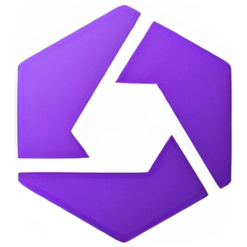
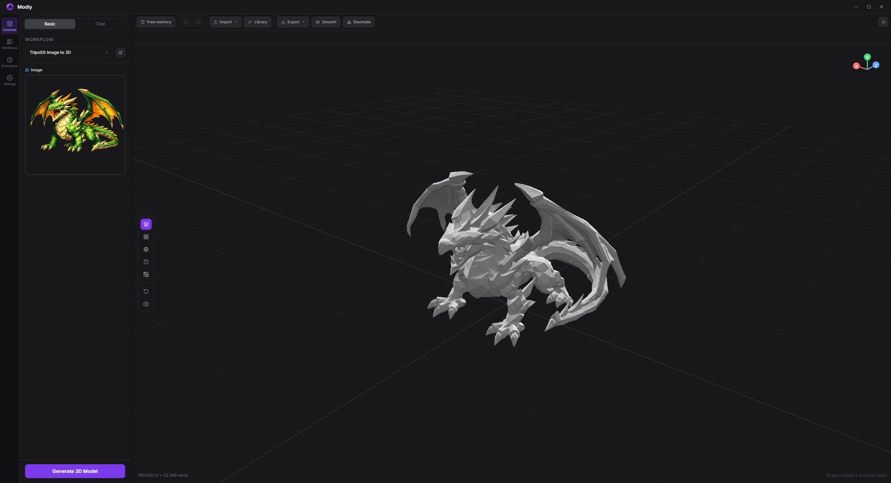
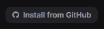
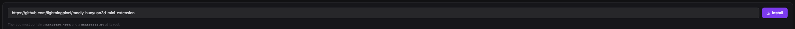
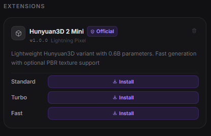

<p align="center">
  
</p>

# Modly

**Local, open source, AI-powered image-to-3D mesh generation.**
Turn any photo into a 3D model using open source AI models running entirely on your GPU.
Modly is a desktop application for Windows, Linux, and Apple Silicon macOS.

> Created by [Lightning Pixel](https://github.com/lightningpixel)

<p align="center">
  
</p>

---


## Download

Head to the [Releases](../../releases/latest) page to download the latest installer for Windows, Linux, or Apple Silicon macOS.

Alternatively, you can clone the repository and run the app directly without installing:

```bash
# Windows
launch.bat

# Linux / macOS
./launch.sh
```

---


## Getting started

### 1. Install JS dependencies

```bash
npm install
```

### 2. Set up Python backend

```bash
cd api
python -m venv .venv
.venv\Scripts\activate     # Windows
source .venv/bin/activate  # Linux / macOS
pip install -r requirements.txt
```

### 3. Run in development

```bash
npm run dev
```

### 4. Test

```bash
npm test
./node_modules/.bin/tsc --noEmit -p tsconfig.node.json
npm run build
```

## Platform notes

- AMD GPUs are supported through ROCm on Linux and Windows: a Radeon card is detected
  automatically and extensions are steered to ROCm PyTorch wheels, with no ROCm install
  required. See [docs/running-on-amd-rocm.md](docs/running-on-amd-rocm.md).
- macOS support targets Apple Silicon only.
- macOS uses native window controls. Windows and Linux keep the existing custom controls.
- The top bar includes a live RAM indicator sourced from the main process.
- Workflow wiring is validated before run; invalid graphs stay in place and surface inline/toast warnings instead of dropping the current mesh view.
- Package Apple Silicon macOS with `npm run package:mac`.
- Imported meshes can be smoothed and decimated in-app; optimized results are written back into the workspace.

---

## Extension system

Modly supports external model and process extensions. Each extension is a GitHub repository containing a `manifest.json` plus the runtime entry files required by its type.

### Official extensions

| Extension | Model | URL |
|-----------|-------|-----|
| [modly-hunyuan3d-mini-extension](https://github.com/lightningpixel/modly-hunyuan3d-mini-extension) | Hunyuan3D 2 Mini | https://github.com/lightningpixel/modly-hunyuan3d-mini-extension |
| [modly-hunyuan3d-mini-turbo-extension](https://github.com/lightningpixel/modly-hunyuan3d-mini-turbo-extension) | Hunyuan3D 2 Mini Turbo | https://github.com/lightningpixel/modly-hunyuan3d-mini-turbo-extension |
| [modly-hunyuan3d-mini-fast-extension](https://github.com/lightningpixel/modly-hunyuan3d-mini-fast-extension) | Hunyuan3D 2 Mini Fast | https://github.com/lightningpixel/modly-hunyuan3d-mini-fast-extension |
| [modly-triposg-extension](https://github.com/lightningpixel/modly-triposg-extension) | TripoSG | https://github.com/lightningpixel/modly-triposg-extension |
| [modly-trellis2-gguf-extension](https://github.com/lightningpixel/modly-trellis2-gguf-extension) | Trellis2 GGUF | https://github.com/lightningpixel/modly-trellis2-gguf-extension |

### How to install an extension

**1.** Go to the **Models** page and click **Install from GitHub**.



**2.** Enter the HTTPS URL of the extension repository and confirm.



**3.** If the extension exposes model nodes, download the model or one of its variants. Process extensions are ready once installation and setup complete.



### Multiple Hugging Face repositories per model node

A model node whose weights are split across repositories can declare
`model_sources`. Modly validates every source, downloads them sequentially in
one Models-page action, and considers the node installed only when every
declared check exists.

```json
{
  "id": "generate",
  "model_sources": [
    {
      "id": "primary",
      "provider": "huggingface",
      "repo_id": "org/main-model",
      "destination": ".",
      "checks": ["model.safetensors"]
    },
    {
      "id": "encoder",
      "provider": "huggingface",
      "repo_id": "org/encoder",
      "revision": "v1.0",
      "destination": "auxiliary/encoder",
      "include_prefixes": ["config.json", "model.safetensors"],
      "checks": ["config.json", "model.safetensors"]
    }
  ]
}
```

`destination`, filters, and checks use safe POSIX paths relative to the node's
model directory. Every check must name a regular, non-empty file included by
that source's filters; invalid plans fail before any file is downloaded. Pin a
tag or commit in `revision` when reproducible weights are required. The only
supported provider is `huggingface`. Existing nodes that use `hf_repo`,
`download_check`, `hf_include_prefixes`, and `hf_skip_prefixes` keep their
original behavior.

### Shared weights inside one model extension

Multi-node model extensions can declare extension-scoped `weight_groups` and
reference them from any sibling node. Shared files are downloaded once under
`<models-dir>/<extension-id>/_shared/<group-id>`, while node-specific
`model_sources` stay under the node's existing model directory.

```json
{
  "id": "pixal3d",
  "type": "model",
  "weight_groups": [
    {
      "id": "pixal3d-base",
      "model_sources": [
        {
          "id": "base",
          "provider": "huggingface",
          "repo_id": "TencentARC/Pixal3D",
          "revision": "<pinned-revision>",
          "destination": ".",
          "checks": ["pipeline.json"]
        }
      ]
    }
  ],
  "nodes": [
    {
      "id": "generate",
      "weight_groups": ["pixal3d-base"]
    },
    {
      "id": "worldsculpt",
      "weight_groups": ["pixal3d-base"],
      "model_sources": [
        {
          "id": "adapter",
          "provider": "huggingface",
          "repo_id": "AlayaLab/WorldSculpt",
          "revision": "<pinned-revision>",
          "destination": ".",
          "checks": ["model.safetensors"]
        }
      ]
    }
  ]
}
```

At runtime, `MODEL_DIR` remains the selected node's private directory.
Subprocess extensions also receive `MODEL_ID`, `MODEL_NODE_ID`, and a JSON
`SHARED_MODEL_DIRS` map in their environment. Both direct and subprocess generator
instances receive `MODEL_ID`, `MODEL_NODE_ID`, and the resolved mapping in
`shared_model_dirs` before `load()`. Direct generators use these instance attributes,
not process-global environment variables, to distinguish sibling nodes.
Shared groups are installed through their dependent nodes; the drawer exposes
shared-group status and explicit removal. Removing private node data never removes a shared group;
shared-group removal is a separate action that identifies every affected node.

### Separately installable weight variants

A model node that publishes the same weights in several variants (quantizations,
precisions…) can declare `weight_variants` next to `hf_repo`. The Extensions page
lists every variant under the node, and each one is downloaded or deleted on its own.

```json
{
  "id": "generate",
  "hf_repo": "org/model-gguf",
  "download_check": "pipeline.json",
  "hf_include_prefixes": ["pipeline.json", "encoder/", "dit/"],
  "params_schema": [
    {
      "id": "quant",
      "label": "Quantization",
      "type": "select",
      "default": "Q5_K_M",
      "options": [
        { "value": "Q4_K_M", "label": "Q4_K_M" },
        { "value": "Q5_K_M", "label": "Q5_K_M" }
      ]
    }
  ],
  "weight_variants": {
    "param": "quant",
    "default": "Q5_K_M",
    "options": [
      {
        "id": "Q4_K_M",
        "label": "Q4_K_M",
        "size_gb": 2.4,
        "vram_gb": 6,
        "include_prefixes": ["dit/model_Q4_K_M.gguf"],
        "checks": ["dit/model_Q4_K_M.gguf"]
      },
      {
        "id": "Q5_K_M",
        "include_prefixes": ["dit/model_Q5_K_M.gguf"],
        "checks": ["dit/model_Q5_K_M.gguf"]
      }
    ]
  }
}
```

- `param` names the `params_schema` select whose values are the variant ids. That
  param must exist on the node (or on the extension, as its fallback), and when it
  declares `options` they must cover every variant id.
- `size_gb` (download size) and `vram_gb` (approximate VRAM the variant needs) are
  optional positive numbers, shown next to the variant when present.
- Every install downloads the shared files (`hf_include_prefixes`, with every
  variant's files excluded automatically) plus one variant: the one asked for, or the
  `default` one — the first option when `default` is omitted. Files already complete
  on disk are skipped, so adding a second variant only fetches that variant.
  Only declared variants are excluded from the shared pass: keep
  `hf_include_prefixes` narrow enough that a variant the repository publishes but
  the manifest does not declare (e.g. an extra `dit/model_Q8_0.gguf`) is not
  downloaded with every install.
- A variant is installed when all of its `checks` exist; the node is installed once
  its `download_check` and at least one variant are present.
- Generation fails with an explicit message when the selected variant is not
  installed, and the node's selector labels those options `(not installed)`.
- `include_prefixes` and `checks` are safe POSIX paths relative to the node's model
  directory. Prefixes of two variants cannot overlap, `download_check` stays outside
  every variant, and `weight_variants` cannot be combined with `model_sources`.

---

## Workflows
Start with a basic workflow first. For example, on the "Workflows" tab, try: Image -> Generate Mesh -> Add to Scene. Make sure there is a connection between each of the steps. Go to the "Generate" tab, make sure the workflow is selected, then click on "Generate 3D Model". Click on "Settings/Logs/Errors" to see any issues.

Model extensions may also declare `scene` as a node input or output. A scene is
a workspace directory containing `scene-manifest.json` with schema
`modly.scene-manifest.v1`; it is not an arbitrary JSON file. Use the **Load
Scene** workflow node to select and validate an existing scene directory.
Scene-capable generators implement `generate_artifact(input_kind,
artifact_path, ...)`; legacy image generators and `POST /generate/from-image`
remain unchanged. The generic `POST /generate/from-artifact` boundary currently
accepts only `scene`, leaving future artifact kinds to separate reviewed changes.
For this first contract, `scene` is model-only and must be declared as the single
`input` value (not inside `inputs`); process and mixed-input scene nodes are rejected.
Model nodes may still accept multiple images and produce a scene.


## Modly CLI

Agents and scripts can call a running Modly desktop app without using the UI via the stdlib-only CLI. The CLI is a thin helper over Modly's canonical automation concepts and keeps final machine-readable JSON on stdout:

```bash
python tools/modly-cli/agent.py health
python tools/modly-cli/agent.py model list
python tools/modly-cli/agent.py workflow-run status <run_id>
python tools/modly-cli/agent.py generate --image ./input.png --output ./export.glb
```

Canonical commands are `health`, `model`, `workflow-run`, `capability`, and `process-run`. The friendly `generate` command starts `POST /workflow-runs/from-image`, polls the returned run, exports the final mesh when requested, and includes recovery metadata such as `workflow-run status ...` and `workflow-run cancel ...` in the JSON response.

Compatibility and helper surfaces are intentionally separated: `legacy` wraps old `/generate/*` job endpoints, `dev serve-api` / `dev ensure-server` start only the FastAPI backend and do not prove Electron/Desktop bridge readiness, and `experimental comfy-image` / `experimental generate-from-workflow` are external ComfyUI orchestration helpers rather than the canonical Modly agent contract. Hidden helper aliases such as `status`, `export`, and `batch` remain parseable for scripts, but they are not presented as canonical root commands.

`experimental generate-from-workflow --workflow <name> --output <path>` treats `--output` as the final artifact location. When the ComfyUI workflow produces a downloadable 3D asset, the CLI downloads it directly; image-only workflows remain a compatibility path through Modly image-to-3D generation.

See `tools/modly-cli/SKILL.md` for the agent workflow and output contract.

---

### Community

Join the [Discord server](https://discord.gg/BvjDCvS3yr) to stay up to date with the latest news, report bugs, and share feedback.

---

## Sponsors

<p align="center">
  Thanks to our early sponsors for believing in Modly and helping make local AI 3D generation more accessible.
</p>

<p align="center">
  <kbd>
    
    <br />
    <sub><a href="https://github.com/DrHepa">DrHepa</a></sub>
  </kbd>
  &nbsp;&nbsp;
  <kbd>
    
    <br />
    <sub><a href="https://github.com/benjapenjamin">benjapenjamin</a></sub>
  </kbd>
  &nbsp;&nbsp;
  <kbd>
    
    <br />
    <sub><a href="https://github.com/iammojogo-sudo">iammojogo-sudo</a></sub>
  </kbd>
</p>

---

## License

MIT License — see [LICENSE](LICENSE) for details.

**If you fork this project and build your own app from it, you must credit the original project and its creator:**

> Based on [Modly](https://github.com/lightningpixel/modly) by [Lightning Pixel](https://github.com/lightningpixel)

This is a requirement of the MIT license attribution clause. Please keep this credit visible in your app's UI or documentation.
