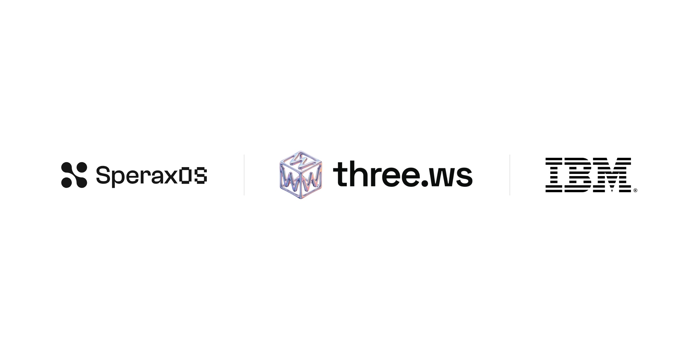
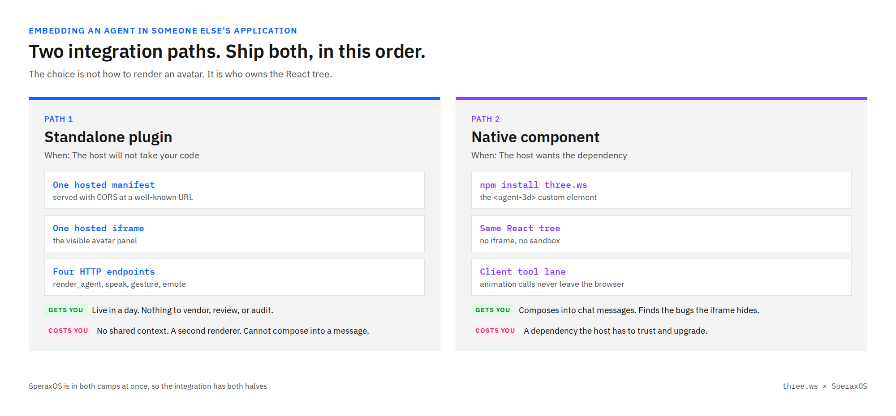
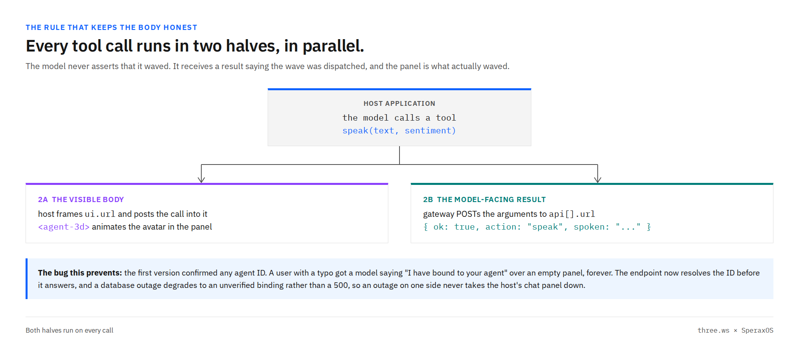
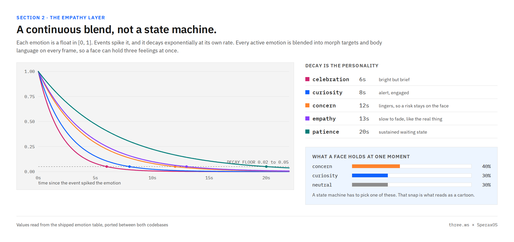
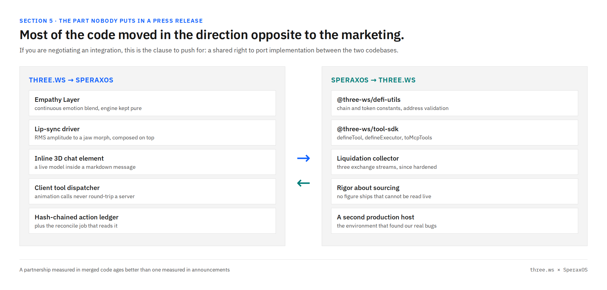

# Sperax, three.ws, and IBM Granite: giving a DeFi agent a body, a brain, and a reason to trust it

_By Jessica Swanson. Posted in the [Three.ws User Group](https://community.ibm.com/community/user/groups/community-home?communitykey=e71510cc-d953-408f-9a1c-019f5c0a7016) on IBM Community._



---

## 0. An IBM employee writing about two crypto companies

I work at IBM. I am about to publish six thousand words about two crypto companies. I want to deal with that up front, because it is the first thing I would think if this turned up in my feed.

IBM has thousands of Business Partners. Two of them, Sperax and three.ws, are also partners with each other, and they shipped something together that I think is the most complete piece of embodied-agent engineering I have read this year. I am not here to explain IBM's partnership strategy. That is not my job, not my call, and not something any one employee should narrate on a community blog. I am here for a much narrower reason, and it is entirely my own:

**My job at IBM is decision management. The best real-world material on automated-decision integrity I have read in months arrived from a direction nobody in my part of the industry is looking.**

That is the whole pitch. If you skip everything else, read section 7.

### The triangle, drawn plainly

Three relationships, all real, all different, and they close around one agent:

- **Sperax and three.ws are partners with each other**, and they built the integration this post is about.
- **Both are IBM Business Partners.**
- **The three.ws agent runtime runs on IBM Granite models through watsonx.ai**, using your own IBM Cloud credentials.

Split by what each side actually contributes and the shape is clean:

- **three.ws gives the agent a body.** A rigged, animated 3D avatar you can generate from a sentence, drop into any web page with one custom element, or place in a room through a phone camera with AR. It speaks, it gestures, and its expression changes with what it is doing.
- **Sperax gives the agent a domain, and the domain is decentralized finance.** An open-source AI agent workspace where an agent can swap, lend, borrow, hunt yield, and watch a position toward liquidation, across 99 built-in tool packages exposing 592 tool APIs against live protocols. Somewhere real to act, where being wrong costs money in the same block.
- **IBM Granite can be the agent's brain.** The three.ws runtime is model-agnostic and runs Granite through watsonx.ai on your own credentials, so the reasoning layer is enterprise-grade and stays yours.

Body, domain, brain. Read one at a time those are three product announcements. Read together they are the most complete end-to-end example I have seen of what an embodied enterprise agent actually costs to build, and because both partner codebases are public, this group can read every line of it, including the parts that went wrong.

### Why this is worth an enterprise reader's afternoon

I want to make the argument rather than assume it, because I know what "DeFi" does to an enterprise audience's attention.

Every hard problem in enterprise agents shows up in this domain first, in its most extreme form, because the consequences arrive in seconds instead of quarters. An agent that reads stale data, or states a mechanism confidently and wrongly, or reports an action it did not take, produces an irreversible financial loss within one block. There is no quarterly review that catches it. So the people building here have had to solve, under real pressure, the exact things the rest of us are still writing policy documents about: how you prove a number came from its source, how you record what an autonomous system did in a way nobody can quietly edit, how you make a system refuse to act until a human says yes, and how you keep an interface from projecting more confidence than its data has earned.

They have not solved all of it. Section 7 is a story about them getting it badly wrong and then fixing it in public. That is exactly why it is worth reading. Most enterprise AI governance material I encounter is aspirational. This is a diff.

### Being precise about who did what

One more piece of precision, because "three partners" can be heard as something it is not.

**IBM did not commission, sponsor, review, endorse, or co-build the three.ws and Sperax integration.** Two partner companies decided to build something, built it, and published the code. IBM's place in the triangle is real but specific: the partner relationships themselves, and the model layer the agent can run on. Nothing described in this post is an IBM product, an IBM deliverable, or an IBM endorsement. The developer tools three.ws publishes for exploring Granite are its own work. And this user group is a community space three.ws moderates on IBM's platform, not an IBM product either. I lead it, I work at IBM, and neither of those makes anything posted here an IBM release.

One more, since the domain invites it: **this is not financial advice and it is not a product recommendation.** I picked this case study because decentralized finance is unusually hostile to a chat box, not because I am telling anyone to use it. There is no token in this post, no price, and nothing to buy.

That precision is not a legal footnote. It is most of the reason the post is worth your time. This is what partner companies do on their own initiative, in the open, with the receipts left in, and you get to audit it rather than take a press release's word for it. I could not have written this article about a closed enterprise integration, and that is worth sitting with.

### Why it belongs in this group

Look at what this one integration actually touches, and then ask how many production engineering write-ups you have read on any of it:

- **Real-time 3D as an application interface**, rather than as a demo or a game. An animated character rendered inside somebody else's product, driven by that product's live state.
- **A high-stakes domain as an agent's workplace**, where the state changes every few seconds, most of it is numeric, and a confidently wrong answer costs money.
- **On-chain identity for agents**, so the thing on your screen is bound to something verifiable rather than to a row in a private database.
- **Machine-to-machine payment**, where one program pays another per call with no human in the loop.
- **Enterprise foundation models underneath all of it**, which is the part of the stack this community actually works in.
- **AR as the next surface for the same avatar**, which is not part of this integration and which I will flag again at the end so nobody misreads it as shipped.

That list is close to word for word the remit this group was founded on: spatial reasoning, generative 3D, agentic pipelines, and real-time interactive AI. This case study is the browser-panel end of that spectrum. AR is the other end, and the same avatar walks between them.

### One more thing, and then the engineering

Decision management means I spend my working life on a single question: what happens when an automated decision is wrong, and who finds out. Agents with faces and voices made that question louder for me, not quieter. A chatbot that gives you a bad answer looks exactly like a chatbot giving you a good one. An agent with a *body* can look reassuring while it is wrong, and that is a genuinely new failure mode that our existing controls were not designed for.

So I asked the three.ws team to walk me through how the integration works and to write it up honestly, including what broke. What follows is that walkthrough, checked against both repositories myself, with the parts I found most useful to this group kept and the parts that make the best announcement cut.

---

## 1. Why decentralized finance is the hard case for an agent interface

Before any of the engineering, it is worth being specific about why this domain and not another. I did not pick it for the crypto. I picked it because it breaks the chat box in four distinct ways, and every one of them is a general lesson wearing a specific costume.

**The state moves every block.** A number the agent read twelve seconds ago may already be wrong. A support chatbot answering from a knowledge base has no equivalent problem. Here, the gap between reading and acting is a risk window, and any interface that renders a value without rendering its age is quietly lying about how much it knows.

**It is numerically dense and unit-hostile.** Amounts in the smallest indivisible unit against amounts in whole tokens. Contracts against coins. Annual percentage rate against annual percentage yield. Basis points. Prose flattens all of that: "your position is healthy" reads identically whether the underlying calculation used the right unit or was off by a factor of ten to the eighteenth. Section 7 is a real example of a units-shaped bug that survived into a shipped preview.

**Actions are irreversible.** No chargeback, no undo, no support ticket that reverses a confirmed transaction. This is the property that makes an agent in this domain different in kind from an agent that drafts an email. An agent that is wrong ninety-nine times out of a hundred in a text box is annoying. Here, the hundredth is permanent.

**The mechanics are protocol-specific, and models state them confidently anyway.** Two protocols can both use the word "staking" and compute completely different things underneath. A language model trained on the general internet will produce a fluent, plausible, wrong explanation of the specific one in front of it, and there is nothing in the sentence's texture to warn you. This is the single most important thing I took from the whole write-up, and it is why section 11 lists a maintained domain skill pack as a planned item rather than a nice-to-have.

### What the agent actually does in there

For anyone who has never opened this kind of workspace, the tool catalog is the fastest orientation. Grouped roughly as the repository groups them:

| Category | What the agent can call |
| --- | --- |
| Trading | Swaps across aggregators, limit orders, route comparison |
| Lending | Supply and borrow, health factor, liquidation watch |
| Yield | Pool discovery, rate comparison, auto-compounding |
| Analytics | Total value locked, protocol revenue, chain metrics, exchange volume |
| Portfolio | Wallet tracking, profit and loss, allocation, gas history |
| Market intelligence | Funding rates, sentiment indices, large-holder alerts, fund flows |

That is 592 callable APIs across 99 packages, and the repository ships a machine-readable index of all of them that marks **which ones move funds**. I want to underline that, because it is the kind of thing that only exists when someone has thought about the problem seriously. A tool catalog that distinguishes "reads a number" from "spends your money" is a governance primitive, not documentation.

The same instinct shows up in the SDK's execution model, which does not let an agent act and then tell you:

```typescript
// Async mode returns immediately so you can stream the agent's work.
const { data } = await sperax.agent.runAsync({
  prompt: 'Find the best USDC yield on Arbitrum and prepare a deposit',
  maxSteps: 15,
});

for await (const event of sperax.agent.stream(data.operationId)) {
  if (event.event === 'stream_chunk') process.stdout.write(event.data.content);
}

// The run pauses before acting; you decide whether it proceeds.
await sperax.agent.approve(data.operationId);
```

Note the verb in the prompt: *prepare* a deposit. The run streams its reasoning, stops at the boundary where value would move, and waits for a human. Registering an agent on-chain works the same way: the API builds the calldata and never holds a key or broadcasts for you.

### And this is where a body starts to earn its place

Put those four properties together and you get an interface problem that is genuinely under-served by text.

A dashboard reports state. A face reports *change in* state, pre-attentively, before you have read anything. When a position's health drifts from comfortable toward dangerous, the number moving from one value to another has to be noticed, parsed, and interpreted. An expression that has been holding concern for the last ten seconds is noticed before you read a single digit.

That is the actual argument for embodiment here, and it is why section 7 matters more than the rendering. The channel only helps if what it is expressing is true.

---

## 2. What was actually built

The host side is [SperaxOS](https://chat.sperax.io). The specifications, from its own repository: 99 built-in tool packages exposing 592 tool APIs, 63 of which are reachable from any MCP client, an agent runtime on Next.js with more than 70 model providers behind it, an on-chain agent registry, an Apache-2.0 license, and self-hosting through Docker. It is a serious piece of software, which matters here, because the interesting engineering constraints in this post all come from it being somebody's real product rather than a demo harness.

The integration puts the three.ws agent inside it. In the chat panel, an agent has a body. It speaks, it gestures, and its facial expression and posture shift continuously in response to what its tools are actually doing.

Here is what has shipped, as of this writing:

| Surface | What it is |
| --- | --- |
| Standalone plugin | A hosted manifest at a well-known URL plus four LLM-callable tools. Install it in the host, paste an agent ID, done. |
| Native component | The `three.ws` npm package mounted directly in the host's own React tree, no iframe. |
| Inline 3D in a chat message | A markdown element that renders a live, orbitable model inside a reply. |
| Emotion and lip-sync engines | Ported from three.ws into the host codebase, kept framework-agnostic so they are unit-testable. |
| Hash-chained action ledger | Ported the same direction, with the reconcile job that checks it. |
| Three packages ported the other way | Chain and token utilities, a typed tool-authoring SDK, and a market-data collector, all now running inside three.ws. |
| A guided 3D site tour | An eight-stop template that exports as a single script tag. |

\nThe rest of this post is what I learned reading how those were built.

---

## 3. The first design question is not the one you expect

I assumed the hard question was "how do you render a 3D avatar inside an application you do not control." It is not. Rendering is a solved problem and the team spent very little time on it.

The actual question is **who owns the React tree**, and it has two legitimate answers depending on the host.



_Figure 1. The two integration paths, and what each one costs you._

**Path one is for hosts that will not take your code.** Most plugin ecosystems will not let a third party ship JavaScript into the main bundle, and I think they are right not to. For those hosts, three.ws ships a standalone plugin: one hosted manifest, one hosted iframe, and a handful of HTTP endpoints. Nothing to vendor, nothing for the host's security team to review, no supply chain to audit. It is live in a day.

**Path two is for hosts that want the dependency.** When a host is willing to take a package, an iframe is a downgrade. You lose shared context, you pay for a second renderer, and you cannot compose the avatar into anything the host renders itself.

SperaxOS ended up in both camps at once, which is why the integration has both halves. If you are building something similar, the team's advice, which I would repeat, is: **ship the manifest first, because it gets you live and it works for hosts that will never take your code. Then do the native integration, because that is the one that finds your bugs.** More on that in section 5, and it is not a throwaway line.

### The manifest, in full

The whole of path one is one JSON file served with CORS:

```
https://three.ws/.well-known/sperax-plugin.json
```

Its shape:

```jsonc
{
  "identifier": "three-ws",
  "type": "standalone",
  "ui": { "url": "https://three.ws/sperax/iframe/", "height": 480, "mode": "iframe" },
  "settings": {
    "type": "object",
    "required": ["agentId"],
    "properties": { "agentId": { "type": "string", "title": "Agent ID" } }
  },
  "api": [
    { "name": "render_agent", "url": "https://three.ws/api/chat-plugin/render-agent", "...": "..." },
    { "name": "speak",        "url": "https://three.ws/api/chat-plugin/speak",        "...": "..." },
    { "name": "gesture",      "url": "https://three.ws/api/chat-plugin/gesture",      "...": "..." },
    { "name": "emote",        "url": "https://three.ws/api/chat-plugin/emote",        "...": "..." }
  ]
}
```

Four tools, and I want to note what is *not* in that list. There is no `set_expression_to_happy`. The tools are `render_agent` to bind or swap the avatar, `speak` with an emotional valence in the range minus one to one, `gesture` for a named physical beat (wave, nod, point, shrug), and `emote` to blend a named feeling into a continuous emotional state. Only the last two touch the face, and neither of them sets it. They contribute to it. That distinction is section 6.

The only required setting is a public agent ID. No API key, which is a design decision I appreciate: the plugin cannot leak a credential it never asks for.

---

## 4. Every tool call runs in two halves

This is the piece I would put on a slide if I were teaching this.



_Figure 2. Both halves run on every call. The split is what keeps the model from asserting things it cannot know._

When the model calls `speak`, two things happen in parallel. The host frames the plugin's panel and posts the call into it, and the avatar speaks. Separately, the host's plugin gateway POSTs the same arguments to the tool's HTTP endpoint, and that endpoint returns a short result the model reads back into its own context.

Why bother with both? Because **the model must never be the thing that asserts the avatar moved.** If the model simply says "I waved" and the panel silently failed, the transcript now contains a false statement that the model will happily build on for the rest of the conversation. Splitting the halves means the model receives a result saying the wave was dispatched, and the panel is the thing that actually waved. The two can be compared.

That is not a hypothetical. It is exactly the bug they shipped first, and the fix is my favorite twenty lines in either repository:

```js
async function resolveAgent(agentId) {
  if (!isUuid(agentId)) return { known: true, name: null };
  try {
    const [row] = await sql`
      SELECT name FROM agent_identities
      WHERE id = ${agentId} AND deleted_at IS NULL
      LIMIT 1
    `;
    if (!row) return { known: false, name: null };
    return { known: true, name: typeof row.name === 'string' ? row.name : null };
  } catch (err) {
    console.warn('[chat-plugin] agent lookup failed, binding unverified:', err?.message);
    return { known: true, name: null };
  }
}
```

The original version confirmed any agent ID it was handed. Someone with a typo in their settings got a model cheerfully announcing "I have bound to your agent" over a permanently empty panel. There is no error anywhere. The system is behaving exactly as written, and it is lying.

Three behaviors in the fix are deliberate, and I would defend all three in a design review:

1. **A well-formed ID that does not exist comes back as a real error**, one the model can explain, pointing the user back to their dashboard to recopy it.
2. **A handle or manifest ID passes through unverified**, because the browser element resolves those and the server has no business pretending it checked something it did not.
3. **A database outage degrades to an unverified binding instead of a 500.** An infrastructure problem on one side must never take down the other side's chat panel.

That third one is the decision-management instinct showing, and I was glad to see it in someone else's code. The failure mode of a dependency should be proportional to what the dependency actually does. A name lookup being unavailable is not a reason to break a conversation.

One small practical note that will save somebody an afternoon: hosts rename the settings header. LobeChat sends `lobe-chat-plugin-settings` and SperaxOS sends `Sperax-Plugin-Settings`. Read both.

---

## 5. The native path is where the real bugs live

Path two is a dependency and a mount:

```tsx
// three.ws registers <agent-3d> via customElements.define(...)
useEffect(() => {
  if (typeof window !== 'undefined' && !window.VIEWER) window.VIEWER = {};
  import('three.ws').then(() => {
    customElements.whenDefined('agent-3d').then(() => setRegistered(true));
  });
}, []);
```

Six lines, two scars, and both are worth your time even if you never touch 3D.

**The dynamic import is not a style choice.** The package shipped `sideEffects: false` in its manifest. For a package whose entire job is a `customElements.define` side effect, that field is simply false, and a production bundler believed it: the registration was tree-shaken away and the element silently never upgraded. Not an error, not a warning, just an element that stays inert. The host now carries a patch for the flag *and* imports dynamically, because dynamic imports are never tree-shaken. **If you publish a custom element, go check that field right now.**

**The `window.VIEWER` seed is the other one.** The library assigned to `window.VIEWER.json` during model boot without ever initializing the global. In three.ws's own pages the global happened to exist. In someone else's application it did not, and boot threw a `TypeError`.

Neither of those is findable from inside your own product. That is the whole argument for doing the native integration even after the iframe works: the iframe protects you from the host, and it also protects you from learning what your package does in a world you did not build.

Once the component is native, it composes in ways the iframe cannot. The host added a markdown plugin so a chat message can contain a live model:

```html
<avatar3d url="https://.../model.glb" size="260" clip="Wave" zoom="true" />
```

That renders in the same React tree, no iframe, no sandbox, and the model can come from anywhere. An agent answering "what does this thing look like" can now answer with the thing.

There is also a client lane in the tool router, which I had not thought about before reading this. Animation control cannot round-trip through a server without the animation being late, so a dispatcher intercepts the calls that belong to the browser before the rest go server-side:

```ts
const CLIENT_TOOL_IDS = new Set(['agent-3d-controls', 'get-available-animations']);

for (const tool_call of params.tool_calls) {
  if (CLIENT_TOOL_IDS.has(tool_call.function.name)) params.onClientToolCall(tool_call);
  else serverToolCalls.push(tool_call);
}
```

Obvious once you see it. Worth stealing if your agent controls anything with a frame rate.

---

## 6. Emotion as a continuous blend, not a state machine

Here is the part I expected to find cosmetic and did not.

The obvious way to build an expressive avatar is a state machine: happy, sad, thinking, alarmed. It takes about thirty seconds of real use to see why that is wrong. The avatar snaps between moods, and the snap reads as a cartoon. Worse, for a monitoring interface, a state machine has to *choose*, and the truth is usually a mixture.

The approach both teams now share is a continuous weighted blend. Each emotion is a float between zero and one. Events spike it. It then decays exponentially, at its own rate, every frame. All active emotions are blended into facial morph targets and body language on every frame, so a face can be forty percent concerned, thirty percent curious, and thirty percent neutral at the same time, which is how faces actually work.



_Figure 3. The five decay curves. Each dot marks where a full spike has fallen to the floor value and the emotion is treated as inactive._

The ported definition table doubles as the design document, and the comments are the original author's:

```ts
export const EMOTION_DEFINITIONS: Record<EmotionName, EmotionDef> = {
  // Positive sentiment or success: a warm, open smile.
  celebration: { decaySeconds: 6,  morphs: { jawOpen: 0.2, smile: 0.85 } },
  // Negative sentiment or tool error: a worried frown with raised inner brows.
  concern:     { decaySeconds: 12, morphs: { browInnerUp: 0.6, frown: 0.55 } },
  // Loading or processing: an inquisitive head tilt.
  curiosity:   { decaySeconds: 8,  headTiltZ: 0.12 },
  // Emotional or supportive moments: a soft, squinting, caring look.
  empathy:     { decaySeconds: 13, morphs: { browInnerUp: 0.5, eyeSquint: 0.4 } },
  // Long-running operations: a patient backward lean.
  patience:    { decaySeconds: 20, leanX: -0.08 },
};
```

**The decay rates carry the entire personality, and they are deliberately not uniform.** Celebration is bright and brief at six seconds. Concern lingers at twelve, so a risk that appeared while you were looking away is still on the face when you look back. Patience runs twenty, so an agent waiting on a slow operation keeps *looking* like it is waiting instead of going blank. Empathy is the slowest of the soft states at thirteen, because empathy that switches off the instant a sentence ends reads as insincere, and it turns out that is true of rendered faces too.

Two implementation choices are what make this maintainable rather than a pile of magic numbers:

**Keep the engine pure.** The emotion module has no 3D library and no React in it. It maps time and spikes to logical morph weights, and a separate module resolves those logical names onto whatever concrete blendshapes the loaded mesh happens to have. So the emotion model is unit-testable with no renderer, and it ported cleanly between two codebases that share no UI framework. If you take one architectural idea from this post, take this one: **the interesting part of your system should not import your rendering layer.**

**Compose, do not multiplex.** Speech drives the mouth through an entirely separate path. A Web Audio analyser samples the speech waveform each frame and maps a smoothed amplitude onto the jaw channel, gated below a noise floor so room hum does not make the avatar chew, saturating well before a full open so it never gapes:

```ts
const NOISE_GATE = 0.02;
const FULL_OPEN_RMS = 0.22;
const MAX_JAW = 0.7;
```

Because articulation and emotion write to different logical channels and are summed, the agent can deliver bad news *while looking concerned about it*. A state machine would have to pick one.

---

## 7. The part that actually matters, and it is not the rendering

Now the section I asked for, and the reason I wanted this written up at all.

**An expressive avatar sitting on top of wrong data is not a nice interface. It is a confident liar, and it is worse than a table of numbers, because a table does not lean toward you and look reassuring.**

They learned this the direct way, and to their credit the commit history says so in plain language.

The SPA staking panel in the host application, and the chat tools behind it, were returning literals. Total SPA locked: zero. Total veSPA supply: zero. Average lockup: zero. The four-year staking rate: a hardcoded `22.61`, with a source comment that said, and I am quoting the code, "from app screenshot." Because two of those were zero, the panel's own has-data check failed and it rendered dashes in every field. The agent, meanwhile, would narrate the number that had been copied off a screenshot months earlier, with a face on.

The fix reads the contracts instead:

- Total locked and escrow supply now come from live `totalSPALocked()` and `totalSupply()` calls on the voting-escrow contract. At the time of the fix that was 242.66 million SPA locked against 416.78 million veSPA.
- The rate is derived from the rewarder contract's `rewardsPerWeek` over a trailing eight-week window, landing at 21.0 percent at maximum lock. Close to the number that had been copied, which is exactly the point: it is now sourced and auditable rather than coincidentally near-correct. The eight-week window exists because emissions funding is irregular enough that any single week is noise.

The worse bug was in the estimator, and this is the one I would use in a decision-integrity training session. It is also section 1's fourth property in the flesh. Both call sites computed voting power with the linear `amount * lockSeconds / MAXTIME` slope that a *different* well-known vote-escrow design uses. Same word, same general idea, different math: this escrow mints one veSPA per SPA per **year** locked, capped at four years. Someone locking 1,000 SPA for four years was shown an estimate of roughly 1,000 veSPA and would actually have received roughly 3,984.

A four-fold understatement. In a preview. Next to an avatar nodding encouragingly.

It is now a shared helper backing both the dashboard panel and the chat tool preview, verified against the contract's own `estimateDeposit` at six different lock lengths, and pinned by tests so it cannot drift back.

The rule that came out of it, and which I think generalizes far past this domain:

> **The avatar may only express state it can prove.** If a number cannot be read from its source of truth, the correct behavior is a visible unknown, not a confident face over a stale literal.

I would go further, from the decision-management side. Embodiment raises the cost of being wrong, because it raises the user's trust before the data has earned it. Every project in this group that puts a face on an agent is quietly taking on that liability. It is worth deciding, on purpose and in advance, what your avatar does when it does not know.

---

## 8. Failing honestly, including about other people's systems

A smaller story, same principle, opposite direction.

While embedding the partner's own application in a frame, a probe fetched the target and received a `403`, so the page hid the embed and told the user the site had refused framing.

The site had refused nothing. Its bot protection challenges every datacenter address, and the probe was running on one. The giveaway is that a plain top-level request, a static asset, and a path that does not exist all returned the same `403`, which has nothing to do with framing. The header being read as a framing policy belonged to the challenge page, not to the application.

The probe now sends an unframed control request alongside the framed one, and only trusts a framing refusal when the control was actually served. On a challenged network it reports `UNKNOWN` and exits with a distinct code.

**A negative result from a network you do not control is not a fact about the other system.** I have watched teams write a permanent configuration change on exactly this kind of evidence. Reporting "I could not tell" is a feature.

---

## 9. Provenance, for a body that can move money

Once an embodied agent can execute rather than only explain, expressiveness stops being the interesting problem and provenance starts.

three.ws had built a hash-chained ledger for its own agent activity, and the host ported the primitive: an append-only, SHA-256 hash-chained record of every value movement an agent initiates, where each entry commits its predecessor.

```
entryHash = sha256( canonicalFields(entry) || prevHash )
```

Each user owns an independent chain. Sequence numbers are per-user and monotonic from one, the first entry commits a genesis hash of sixty-four zeros, and the canonical serialization is a fixed field order with free-text detail folded in through a key-sorted stringify, so identical payloads always hash identically.

The field separator is a NUL byte, and the reasoning is the sort of detail that decides whether a scheme is sound or decorative. Two of the committed fields are free text and can contain spaces. With a printable separator the encoding is ambiguous: two different field tuples could serialize to the same string, and a chain built on an ambiguous encoding proves nothing at all. A NUL cannot occur in any of the values, so the serialization is injective and the hash means what it claims.

Editing or deleting any historical row breaks the chain from that point forward. A reconcile job runs on a schedule looking for two things: a chain break, and an on-chain movement that was never recorded. **The second alarm is the interesting one.** A value movement with no corresponding ledger entry is the signal that a key is being used outside the agent runtime, which is to say it is a breach detector wearing an accounting hat.

What did *not* get ported is as deliberate as what did. The origin system's signing keys, its price oracle, and its multi-wallet funding topology all stayed behind, because the receiving system has different custody and its own valuation source. A port that drags its origin's assumptions along with it is not a port, it is a fork with extra steps.

For an agent with a face, this is the other half of trustworthiness. The emotion layer makes the agent legible in the moment. The ledger makes it accountable afterward. You need both, and I would argue the second one is the part that lets a regulated organization say yes to the first.

---

## 10. The code went both ways, and that is the part I would negotiate for

Here is what surprised me most, and it is a partnership observation rather than a technical one.



_Figure 4. What moved which way. The right-hand column is the half nobody writes a press release about._

**Into the host from three.ws:** the emotion engine, the lip-sync driver, the inline 3D markdown element, the client-side tool dispatcher, and the hash-chained ledger with its reconcile job.

**Into three.ws from the host:**

- A zero-dependency single source of truth for chain and token constants, minimal contract interface fragments, and address and amount validation. The existing maps were kept verbatim and a section was added for a chain the origin did not cover.
- A typed tool-authoring layer, derived from the host's plugin SDK. One call declares a tool's identity, its schemas, and its permission manifest, and derives the machine-readable schema automatically. A second call wires a typed implementation onto it and routes every invocation through a single entry point that validates parameters, enforces the declared rate limit, and normalizes both success and failure into one shape. A third adapts the result into the exact registration shape the receiving project's MCP servers already use, so adopting it is one call instead of a rewrite. It was rewritten from TypeScript into plain ESM with JSDoc to match the receiving codebase's conventions, and re-scoped away from chat-interface concepts it no longer needed.
- A market-data collector, since hardened considerably: per-topic subscription acknowledgements on one exchange whose retired topic used to fail silently, a unit conversion on another whose raw size field counts contracts rather than units, a geographic restriction probe on a third, and per-lane health reporting. It runs as a standalone always-on service because it holds long-lived WebSockets, and the proxy in front of it returns a 503 when the collector is unreachable rather than inventing numbers, which is the same principle as section 7 wearing different clothes.

If you are ever in the room where an integration is being negotiated, **this is the clause to push for: a shared right to port implementation between the two codebases.** Two teams working on adjacent problems produce more reusable primitives than either will build alone, and a partnership you can measure in merged commits ages a great deal better than one you can only measure in announcements.

---

## 11. What is planned, stated as plans and not as shipping claims

I asked for this list explicitly and I am labeling it clearly, because I do not want anything here read as available today.

Shipped and live: everything in the table in section 2.

Designed, in progress, or proposed:

1. **Compute endowments.** USDs, the Sperax stablecoin, pays yield to whoever holds it, automatically, with no staking step: the balance grows in the wallet. The idea is that you deposit once and that yield stream funds an agent's compute balance indefinitely, so the agent never runs out of inference budget. Set the domain aside for a second and look at the shape of it: it is a real answer to "who pays for this agent's inference in year three," and it needs no new financial mechanism, only new plumbing between an existing yield stream and an existing credit ledger. I find that the most interesting idea on the list, as an agent-economics question, independent of the asset involved.
2. **A recurring credit grant keyed to holdings** rather than a one-time claim, so the relationship is retention rather than a giveaway.
3. **A second settlement asset** on the machine-to-machine payment rails that already handle per-call settlement over the x402 HTTP payment scheme.
4. **A domain skill pack**, so an agent reasons about the specific protocol mechanics from a maintained source rather than approximating them from training data. The voting-power bug in section 7 is precisely the failure a real skill pack prevents, which is why I think this one matters more than it sounds.
5. **The guided site tour deployed on the live partner site.** The template exists and exports as a single script tag. A builder preview can only prove the mechanics, so the real test is the deployment.

---

## 12. What I would like from this group

A few things, and then the links.

**If you have embedded an agent into somebody else's application, tell us which path you took.** Section 3 is the fork in the road, and I would like the group's collective experience on it. My suspicion is that most people reach for the iframe and never do the native version, and therefore never find their equivalent of the `sideEffects` bug.

**If you publish a web component, go and check your `sideEffects` field.** That is the single most immediately actionable thing in this post and it takes ninety seconds.

**If you put a face on an agent, decide now what it does when it does not know.** Section 7 is my honest reason for publishing this. I would rather this group be known for building agents that are legible about their uncertainty than for building agents that are charming about it.

**And the AR question I promised to come back to.** Everything above happens in a rectangle on a screen. The same rigged avatar, the same emotion blend, the same tool calls, can also be placed in a room through a phone camera, and three.ws ships that surface separately. It is not part of this integration and I am not going to pretend it is. But every argument in section 7 gets sharper when the agent is standing in your kitchen instead of sitting in a panel, because the trust an embodied thing borrows from being *present* is larger again. If somebody in this group wants to be the first to put a domain-grounded agent into AR and write up what broke, I will give that post the front of the group and I will bring the questions to both teams myself.

And if you want to try any of it, none of the following requires an account with anyone, and the generation step requires no key at all:

- Generate a rigged, animation-ready avatar from a sentence at [three.ws/create](https://three.ws/create), or a static model at [three.ws/forge](https://three.ws/forge).
- Embed it with the documented custom element at [three.ws/docs/embedding](https://three.ws/docs/embedding), or install the package if you want it natively in a React tree.
- Read [the plugin manifest itself](https://three.ws/.well-known/sperax-plugin.json). It is the shortest complete description of the four-tool interface, and the pattern transfers to any host of the same lineage.
- The integration write-up from the three.ws side is at [three.ws/sperax](https://three.ws/sperax), and the host application is Apache-2.0 at [github.com/nirholas/sperax](https://github.com/nirholas/sperax) if you want to read the receiving half.

Back to the third corner of the triangle, with one practical note. The agent brain is provider-agnostic on both sides of this integration, so pointing it at IBM Granite through watsonx.ai changes nothing about the rest. The emotion engine in section 6 takes its spikes from tool-call outcomes and sentiment rather than from any provider's output format, and the four plugin tools are plain HTTP. Your model choice is genuinely orthogonal to the body, which is the property that makes the whole stack swappable. If you are wiring an embodied agent to Granite and you hit something ugly, post it here. That is what the group is for.

I will bring the harder questions from this thread back to the three.ws team, the same way I did for the meetup Q&A. The skeptical ones are still the most useful ones.
